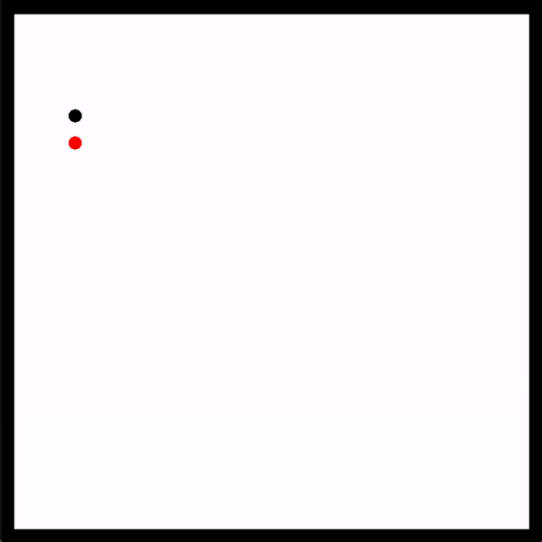

# SFML-SnakeGame
SFML implementation of the classic Snake game first introduced in the Nokia 6110. The snake and "food" are represented as black and red circles, respectively. The food is randomly positioned within the container and the snake grows upon eating the food. Upon running the executable (must be compiled), pressing the "Spacebar" will initiate the game. You loose if you hit a wall or the snake "bites its own tail." Have fun! 

